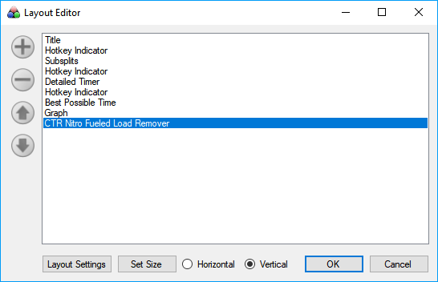
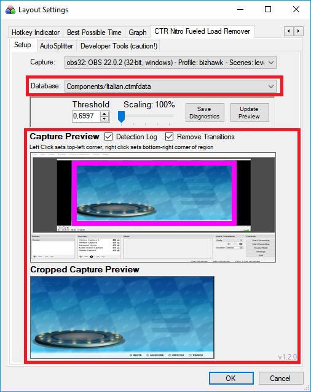

# How to set it up

Put the LiveSplit.Crash4LoadRemover.dll into your LiveSplit/Components folder.

Add this to LiveSplit by going into your Layout Editor -> Add -> Control -> Crash4LoadRemover.

You can then configure your capture settings (window/display) and capture region within the component settings in the Layout Settings.

Make sure that sure game footage is fully and accurately captured and that you don't distort/change the aspect ratio, color saturation, contrast or do any other aggressive filtering on the image footage, this will lead to detection issues.

Make sure that the yellow/orange text at the top of every load screen, as well as the blue/black swirl at the bottom left after every load screen are not covered by stream overlays or other stuff, otherwise you might encounter issues in load screen detection.

The following screens show how it would be correctly set up:

# Common Issues / Guidelines when setting up

Here is a short list of things that you should do and common issues when setting this thing up:

- Make sure that the window/source you're capturing the game from is as large as possible. I know the whole "capturing from OBS" is not ideal, but please try to keep the game footage as large as possible for best results.

- Make sure that your game footage aspect ratio (that is the ratio between width and height of the game) is 16:9, which is the default/raw game footage. Do not squish/distort it in any way, for example in OBS, this WILL lead to worse detection performance!

- Make sure to not zoom in (or otherwise increase or decrease) the game footage.

- Make sure that the pink capture rectangle captures the game footage as close as possible. You can use the "Crop Rectangle" up/down UI elements to precisely position your crop rectangle. A better crop means better load remover performance.

- If you're capturing from a window, you must not minimize the window. Ideally, maximize it (for larger game footage size!) and just put your other stuff over it if you want to have it "hidden" from view. The only condition is that you must not minimize the window.

- You need to compare to "Game Time". This is easily set by right-clicking LiveSplit, selecting "Compare Against" and ticking "Game Time". Be careful that you don't have your Timer in your LiveSplit layout set to "Real Time", because this will override this setting. I recommend adding 2 timers, with one showing "Real Time" and the other showing "Game Time".

- The load remover is still very much in its early phase, and I need feedback and problematic game footage to improve the detection accuracy. I'm not sure how reliably it currently works overall. I seem to encounter no issues on most game footage.

- About the "Scaling" setting: You should only need to change this if you have the Display Scaling set in Windows. (Display Settings -> "Change Size of text, apps and other items"). Otherwise you can leave this at 100%.

- This might not work for windows with DirectX/OpenGL surfaces, nothing I can do about that. (Use Display capture for those cases, sorry, although even that might not work in some cases). In those cases, you will probably get a black image in the capture preview in the component settings.

# Crash Speedrunning Discord

Make sure to check out the [Crash HD Speedrunning Discord!](https://discord.gg/Rb9qjtU)

There are tons of speedrunners there that are already familiar with my load removers and can help you diagnose issues and help you get started.

# LiveSplit.Crash4LoadRemover
LiveSplit component to automatically detect and remove loads from "Crash Bandicoot 4: It's About Time".

This is adapted from my Crash NST and Crash Team Racing: Nitro Fueled vision-based load removers: 

https://github.com/thomasneff/LiveSplit.CrashNSTLoadRemoval 

https://github.com/thomasneff/LiveSplit.CTRNitroFueledLoadRemover

and from https://github.com/Maschell/LiveSplit.PokemonRedBlue for the base component code.
